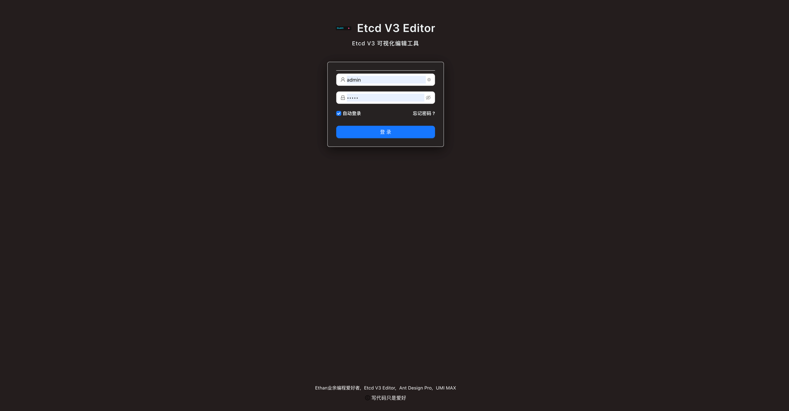

# ETCD V3 EDITOR 🚀


## 中文

### 项目概览

欢迎体验 **ETCD V3 EDITOR**，一个开源的全栈应用程序，旨在提供高效且可扩展的解决方案！后端基于 **go-zero**
构建，这是一个高性能微服务框架；前端采用 **Ant Design Pro**，提供现代化、直观的用户界面。无论你是开发者还是贡献者，我们都很高兴欢迎你的加入！

### 特性

- **后端**: 基于 go-zero，支持统一的数据结构返回，（详见 [go-zero 文档](https://go-zero.dev/docs/tutorials/cli/template)
  ），进行了模板改造针对 zero,结构如下。

```json
{
   "code": 0,
   "msg": "",
   "data": {}
}
```
- **前端**: 采用 Ant Design Pro，打造流畅、响应式的用户体验。
- **部署方式**: 支持前后端分离部署、Docker 和 Electron，Docker-Compose.yml。
- **内嵌构建**: 运行 `yarn spa`，前端编译产物将内嵌到后端路径 `backend/etc/dist`。
- **配置文件**: 后端配置文件位于 `backend/etc`，默认账户：`admin` / `admin`。

```yaml
# restful service base config
Name: etcd-web-tool-service
Host: 0.0.0.0
Port: 8888

#https://go-zero.dev/docs/tutorials/http/server/middleware#loghandler
Middlewares:
  Log: true


# serv conf for log
Log:
  ServiceName: etcd-web-tool-service
  Encoding: plain
  TimeFormat: '2006-01-02 15:04:05.999999999'
  Level: debug


#login user and pass
UserName: admin
Password: admin

#Using embedded front-end code? By default, 
#nginx and docker are executed in a container separated from the front and back ends, as described in Docker-compose
Spa: true

# Enable JWT, symmetric encryption
Auth:
  # Generate the symmetric key openssl rand-base64 32 for signing and verifying signatures, which can be changed periodically by itself
  AccessSecret: ESrQr4UGaMoxelQypmaL90dupsbrRd+dQQW6t+4p9+k=
  # Token 过期时间 单位 s
  AccessExpire: 3600


# etcd base configuration 
Etcd:
  Hosts:
    - 192.168.2.94:2379 #modify yours
    - 127.0.0.1:2379
  ID: 1
  Key: etcd.web.tool #the service key 
  User: root
  Pass: '123456'
#  CertFile: ""
#  CertKeyFile: ""
#  InsecureSkipVerify: true


```
- **自动化工具**: 提供 `Makefile`，用于快速生成 API。

### 快速开始

1. **克隆仓库**
   ```bash
   git clone https://github.com/username/project-name.git
   ```
2. **安装依赖**
    - 前端：`cd frontend && yarn install`
    - 后端：确保安装 Go，然后 `cd backend && go mod tidy`
3. **运行项目**
    - 编译前端：`yarn spa`
    - 启动后端：`cd backend && go run .`
4. **访问**  
   在浏览器中打开 `http://localhost:8080`，使用 `admin` / `admin` 登录。

### 运行效果

| 登录页面                    | 视图 1                      | 视图 2                      |
|-------------------------|---------------------------|---------------------------|
|  |  |  |

### 贡献指南

我们非常欢迎贡献！

---

