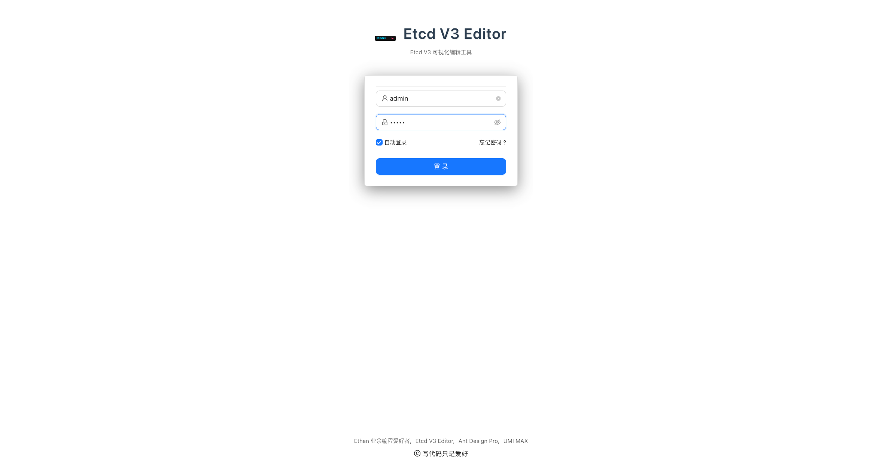
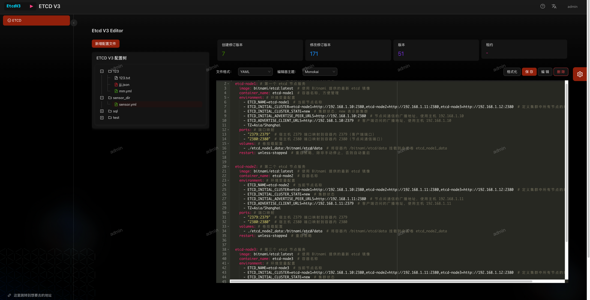
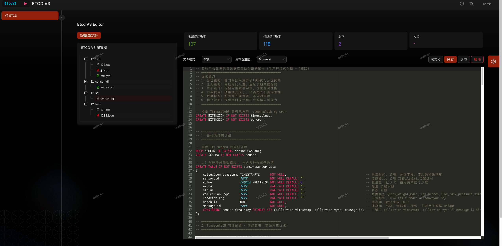

# ETCD V3 EDITOR 🚀


**[English](#english) | [中文](README-zh.md)**

---

## English

### Overview

Welcome to **ETCD V3 EDITOR**, an open-source full-stack application designed for efficiency and scalability! The backend
is powered by **go-zero**, a high-performance microservices framework, while the frontend is built with **Ant Design Pro
**, delivering a modern and intuitive user interface. Whether you're a developer or contributor, we’re excited to have
you onboard!

### Features

- **Backend**: Built with go-zero, featuring a custom response structure (
  see [go-zero docs](https://go-zero.dev/docs/tutorials/cli/template)).
- **Frontend**: Powered by Ant Design Pro for a sleek, responsive UI.
- **Deployment Options**: Supports standalone frontend-backend separation, Docker, and Electron.
- **Embedded Build**: Run `yarn spa` to compile the frontend, which gets embedded into the backend at
  `backend/etc/dist`.
- **Configuration**: Backend config files located at `backend/etc`. Default credentials: `admin` / `admin`. you can modify 
the configuration file according your needs. the notes are chinese only . but it's easy and simple .such :

```yaml
# restful service base config
Name: etcd-web-tool-service
Host: 0.0.0.0
Port: 8888

#https://go-zero.dev/docs/tutorials/http/server/middleware#loghandler
Middlewares:
  Log: true


# serv conf for log
Log:
  ServiceName: etcd-web-tool-service
  Encoding: plain
  TimeFormat: '2006-01-02 15:04:05.999999999'
  Level: debug


#login user and pass
UserName: admin
Password: admin

#Using embedded front-end code? By default, 
#nginx and docker are executed in a container separated from the front and back ends, as described in Docker-compose
Spa: true

# Enable JWT, symmetric encryption
Auth:
  # Generate the symmetric key openssl rand-base64 32 for signing and verifying signatures, which can be changed periodically by itself
  AccessSecret: ESrQr4UGaMoxelQypmaL90dupsbrRd+dQQW6t+4p9+k=
  # Token 过期时间 单位 s
  AccessExpire: 3600


# etcd base configuration 
Etcd:
  Hosts:
    - 192.168.2.94:2379 #modify yours
    - 127.0.0.1:2379
  ID: 1
  Key: etcd.web.tool #the service key 
  User: root
  Pass: '123456'
#  CertFile: ""
#  CertKeyFile: ""
#  InsecureSkipVerify: true


```
- **Automation**: Includes a `Makefile` for quick API generation.

### Getting Started

1. **Clone the Repository**
   ```bash
   git clone https://github.com/chenleijava/etcdv3-editor
   ```
2. **Install Dependencies**
    - Frontend: `cd frontend && yarn install`
    - Backend: Ensure Go is installed, then `cd backend && go mod tidy`
3. **Run the Project**
    - Compile frontend: `yarn spa`, the out path is backend/etc/dist by default
    - Start backend: `cd backend && go run .`
4. **Access**  
   Open your browser at `http://localhost:8000` and log in with `admin` / `admin`.

### Screenshots

| Login Page              | View 1                    | View 2                    |
|-------------------------|---------------------------|---------------------------|
|  |  |  |

### Contributing

We welcome contributions! Please check our [Contributing Guidelines](CONTRIBUTING.md) and feel free to submit issues or
pull requests.

### License

This project is licensed under the MIT License - see the [LICENSE](LICENSE) file for details.

---
### My VC

Here's my VC, and if I can help you with your work or give me an opportunity to work remotely, I'd be happy to do it

- [View Full Resume (HTML)](./CV_EN.html)

---
